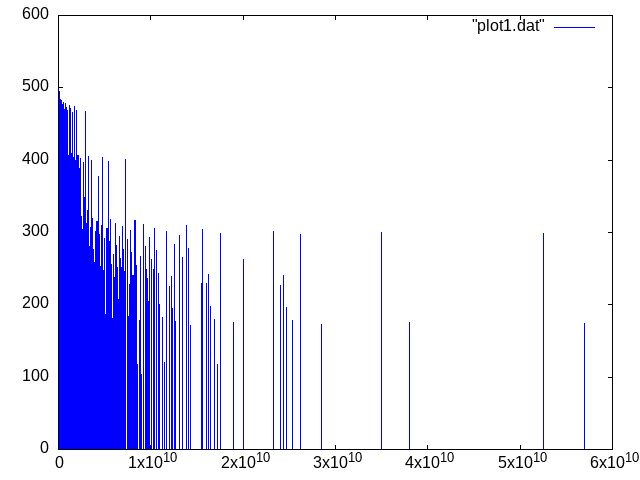

# Plots of the Collatz sequence

from [Wikipedia.org](https://en.wikipedia.org/wiki/Collatz_Conjecture):
<blockquote>
The Collatz conjecture is a conjecture in mathematics that concerns a sequence defined as follows: start with any positive integer n. 
Then each term is obtained from the previous term as follows: if the previous term is even, the next term is one half of the previous term. If the previous term is odd, the next term is 3 times the previous term plus 1. 
The conjecture is that no matter what value of n, the sequence will always reach 1. 
</blockquote>

## What's in this repo?

I wanted to create this repository because of my interest in Mathematics and number theory; and of course because of my love for the Haskell programming language.
What I created using haskell is an implementation of two main recursive functions that generate two different sequences.

The first one that I created, `collatzSeqOfSteps` takes an `Integer` called `limit` as its input and generates the sequence of all the cardinalities of each sequence generated by every integer x from 1 to `limit`.
I have implemented it using Tail-Recursion optimization and a little bit of dynamic programming.
The following plot represents `collatzSeqOfSteps` as `limit` values 10^7:


The second one, `collatzGen`,  generates a collatz sequence starting with an arbitrary, that is the input of the function.
This is just an example plot as the input of the function values 1397919012, but you can find even more example plots on the [img](https://github.com/meloncello/collatz-hs/tree/master/img) folder if you want!


## If you want to run/modify/doing whatever you want to with it :
You will need:
* git (for cloning this repo locally)
* GHC
* cabal (for installing the dependencies or for running it)

## License
```
            DO WHAT THE FUCK YOU WANT TO PUBLIC LICENSE
                    Version 2, December 2004

 Copyright (C) 2004 Sam Hocevar <sam@hocevar.net>

 Everyone is permitted to copy and distribute verbatim or modified
 copies of this license document, and changing it is allowed as long
 as the name is changed.

            DO WHAT THE FUCK YOU WANT TO PUBLIC LICENSE
   TERMS AND CONDITIONS FOR COPYING, DISTRIBUTION AND MODIFICATION

  0. You just DO WHAT THE FUCK YOU WANT TO.
 ```
